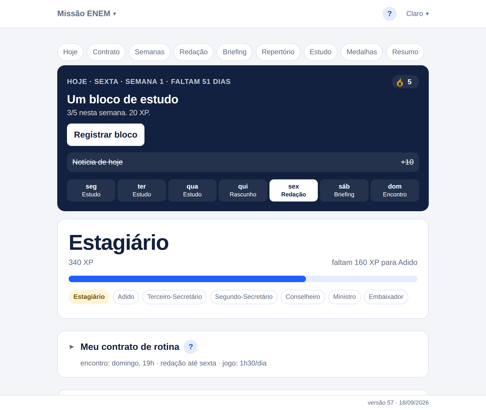
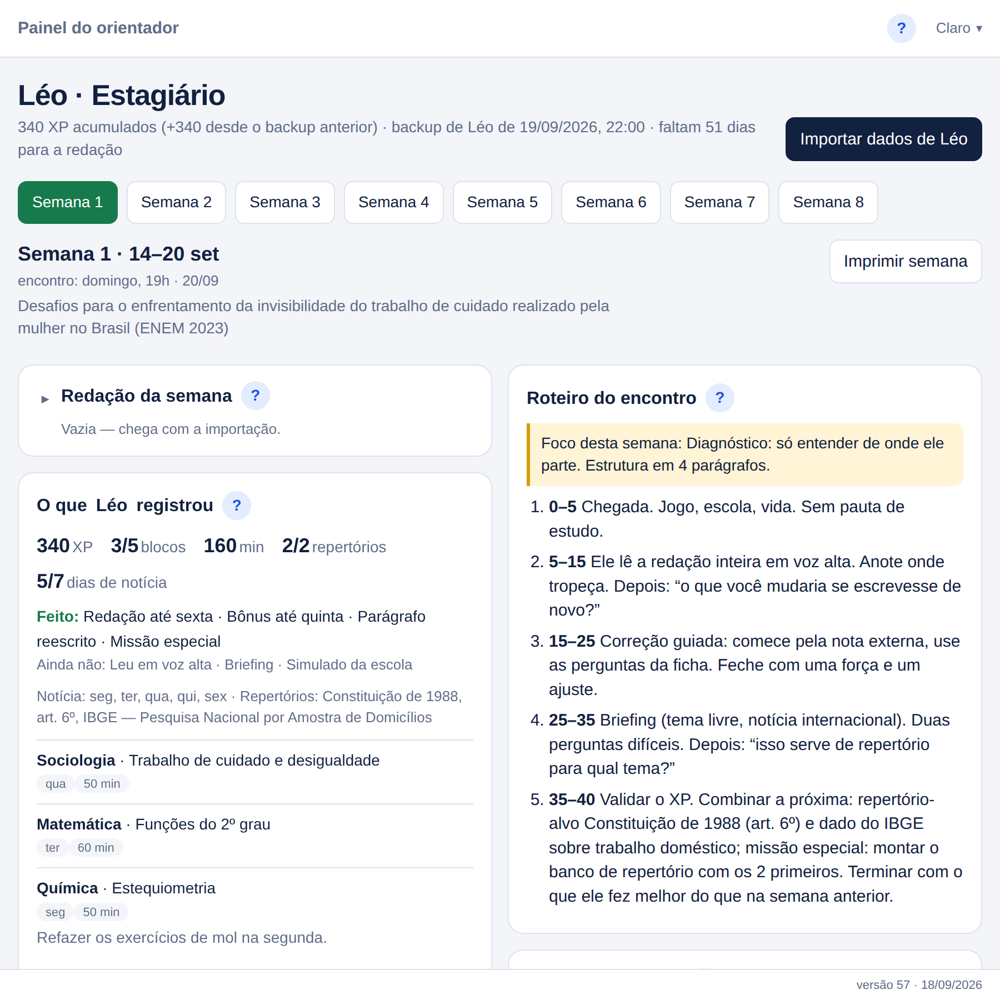

<div align="center">


# Missão ENEM

**App gratuito de redação e rotina de estudos para o ENEM — offline, sem conta, sem servidor.**

Uma redação por semana, correção pelas cinco competências (C1–C5), banco de repertório,
blocos de estudo, notícia do dia e XP com patentes. Um painel para o **estudante** e outro
para quem **orienta** (pai, mãe, professor ou tutor), ligados por um encontro semanal de 40 minutos.

[](../../releases/latest)
[](../../releases)


### [⬇️ Baixar a última versão](../../releases/latest)

</div>

---

<picture>
  <source media="(prefers-color-scheme: dark)" srcset="img/aluno-hoje-escuro.png">
  
</picture>

<p align="center"><em>O painel do estudante abre em “o que eu faço agora”, não em “o que eu já fiz”.</em></p>

## Índice

- [O problema que ele resolve](#o-problema-que-ele-resolve)
- [Como funciona a semana](#como-funciona-a-semana)
- [Os dois painéis](#os-dois-painéis)
- [Baixar e instalar](#baixar-e-instalar)
- [Seus dados ficam com você](#seus-dados-ficam-com-você)
- [Atualizações automáticas](#atualizações-automáticas)
- [Usar com outro estudante](#usar-com-outro-estudante)
- [Perguntas frequentes](#perguntas-frequentes)
- [O que ele não é](#o-que-ele-não-é)
- [Como foi feito](#como-foi-feito)

## O problema que ele resolve

Quem se prepara para a redação do ENEM sabe o que precisa fazer — escrever toda semana, ler
notícia, juntar repertório, entender a nota. O que falta quase sempre é **rotina** e **devolutiva**:
alguém que leia, pergunte e devolva uma coisa para melhorar.

Este app nasceu de um combinado entre um pai e um filho que moram em cidades diferentes: uma
chamada de vídeo por semana, de 40 minutos, com um roteiro fixo. Ele organiza os dois lados desse
combinado — o que o estudante faz durante a semana e o que o orientador faz no encontro —
e não precisa de internet, conta, assinatura ou plataforma nenhuma para funcionar.

**Princípios que guiaram cada tela:**

| | |
|---|---|
| 🎯 **O próximo passo é o produto** | A primeira coisa da tela é um card que lê a data, a semana e a rotina combinada e diz o que fazer agora, com um botão. Histórico e gráficos vêm depois. |
| 📈 **XP nunca é descontado** | Semana ruim é semana com pouco XP, nunca negativa. A comparação é com a semana anterior do próprio estudante — e ela aponta o alvo (“faltam 160 para passar a semana 2”), nunca a dívida. |
| 🤝 **O estudante propõe, o orientador valida** | Dias, horários, limite de jogo e recompensas são preenchidos por quem estuda. A tela não é instrumento de vigilância. |
| 🗣️ **Uma força e um ajuste por semana** | A ficha de correção existe para a leitura em voz alta e para fechar com **uma** coisa que foi bem e **uma** para mudar — não para uma lista de erros. |
| 🔒 **Nada sai do computador** | Sem conta, sem nuvem, sem telemetria. A ponte entre os dois painéis é um código de backup copiado e colado. |

## Como funciona a semana

Um ciclo de **8 semanas** até a prova, com tema, foco de correção e repertório-alvo definidos
semana a semana:

```
Segunda a quinta   ·  10 min de notícia por dia  ·  blocos de estudo  ·  repertório novo no banco
Quinta ou sexta    ·  redação da semana entregue (bônus por entregar antes)
Sábado             ·  briefing: preparar uma notícia para explicar em voz alta
Domingo, 40 min    ·  o encontro
```

O encontro tem roteiro na tela, com o relógio ao lado de cada parte:

| Minutos | O que acontece |
|---|---|
| 0–5 | Chegada. Jogo, escola, vida. Sem pauta de estudo. |
| 5–15 | **Leitura em voz alta** da redação inteira, pelo estudante. |
| 15–25 | Correção guiada por perguntas, começando pela nota. Fecha com uma força e um ajuste. |
| 25–35 | Briefing da notícia da semana, com duas perguntas difíceis. |
| 35–40 | Validar o XP, combinar a próxima semana, dizer o que foi melhor que na anterior. |

**Gamificação que não pune:** cada tarefa vale XP (redação 100, briefing 50, leitura em voz alta 40,
notícia 10/dia com bônus de 50 na semana completa, bloco de estudo 20…), com teto de 620 por semana.
O XP acumulado sobe por **sete patentes**, de Estagiário (0) a Embaixador (4400), e cada patente
destrava uma recompensa que os dois combinaram no contrato de rotina. Há ainda **8 medalhas** e uma
sequência de dias perfeitos — acesa quando o dia fecha, gelada enquanto não.

## Os dois painéis

### 🎒 Estudante

Painel Hoje com o próximo passo · contrato de rotina (dias, horários, limite de jogo, recompensas) ·
checklist da semana com XP · redação com contador de linhas e parágrafos · briefing de notícia ·
banco de repertório · banco de blocos de estudo com notas em formato do WhatsApp (`*negrito*`,
`_itálico_`, listas) · medalhas · resumo pronto para mandar ao orientador · backup.

### 🧭 Orientador



Importa o backup do estudante e mostra, lado a lado, **o que ele registrou** e **o que fazer agora**:
roteiro do encontro, ficha de correção C1–C5 (0–200 cada, total 0–1000) com as perguntas por
competência, elementos da proposta de intervenção, briefing, anotações, gráfico de evolução das
notas e um gerador de prompts para colar em qualquer assistente de IA (corrigir, motivar, preparar
briefing, pedir reescrita, analisar evolução). O painel **nunca edita** os dados importados: ele lê.

Impressão preparada para papel: contrato de rotina, ficha da semana e banco de repertório.

### 📚 Escolha de curso (bônus)

Um terceiro arquivo, `Escolha_Curso_Arthur.html`, é um documento comparando três cursos de uma
universidade específica, com um **roteiro e uma ficha para pesquisar qualquer outro curso** —
grade, mercado, custo, perguntas para fazer a quem já cursa. É material de exemplo; a parte
reaproveitável é o roteiro.

## Baixar e instalar

Todas as versões estão em **[Releases](../../releases/latest)**. Cada uma traz:

| Arquivo | Para que serve |
|---|---|
| `Missao-ENEM-Setup-N.0.0.exe` | Instalador do **Windows** (por usuário, sem senha de administrador) |
| `Missao-ENEM-N.0.0.AppImage` | O app do **Linux**, um arquivo executável |
| `Missao_ENEM_Arthur.html` | O painel do estudante **avulso**, abre no navegador sem instalar nada |
| `Missao_ENEM_Orientador.html` | O painel do orientador avulso |
| `Escolha_Curso_Arthur.html` | O documento de escolha de curso |
| `latest.yml` · `latest-linux.yml` · `.blockmap` | Índices que o app instalado lê para se atualizar sozinho |

### Windows

Baixe o `.exe` e execute. **O instalador não é assinado**, então o Windows mostra a tela azul do
SmartScreen (“O Windows protegeu o computador”): clique em **Mais informações** → **Executar assim
mesmo**. Isso acontece uma vez por versão nova, e é o preço de não comprar um certificado de
assinatura.

### Linux

```bash
chmod +x Missao-ENEM-*.AppImage
./Missao-ENEM-*.AppImage
```

Se aparecer `dlopen(): error loading libfuse.so.2`, o arquivo está inteiro — falta uma biblioteca do
sistema. No Ubuntu 24.04 e mais novos: `sudo apt install libfuse2t64` (nas versões anteriores,
`libfuse2`). Sem poder instalar nada, `./Missao-ENEM-*.AppImage --appimage-extract-and-run` abre —
mas por esse caminho o app **não se atualiza** sozinho.

Guarde o AppImage numa pasta onde você possa escrever (a pasta pessoal serve): é ele mesmo que se
reescreve quando chega uma versão nova.

### Sem instalar nada

Baixe os arquivos `.html` do release e **abra com duplo clique**. Cada um é um arquivo só — HTML,
CSS e JavaScript no mesmo documento, sem CDN, sem fonte externa, sem dependência — que funciona do
disco (`file://`), offline, no computador ou no celular. É a mesma tela do app; o que muda por baixo
é onde os dados ficam guardados.

### Na primeira abertura do app

Ele pergunta **quem está usando** e guarda a resposta neste computador:

- **Estudante** — pede nome e e-mail. O nome aparece nas telas; o e-mail é a chave pela qual o painel
  do orientador guarda os dados dele.
- **Orientador** — pede uma senha, escolhida por quem montou a versão, e pedida em toda abertura.

## Seus dados ficam com você

Não existe conta, login, servidor ou banco de dados na nuvem. **A única coisa que o app faz na rede
é perguntar se existe versão nova** — sem token, sem identificador, sem telemetria — e, se não houver
internet, ele funciona igual do começo ao fim.

| Onde você usa | Onde o progresso fica |
|---|---|
| Navegador (arquivo `.html`) | `localStorage` daquele navegador, naquele aparelho |
| App instalado | Um banco SQLite na pasta de dados do sistema: `~/.config/missao-enem/` (Linux) ou `%APPDATA%\Missão ENEM\` (Windows) |

No app, uma **cópia automática** do estado é guardada na primeira gravação de cada dia, e as 14 mais
recentes ficam à mão para restaurar com um clique. Instalar por cima, reinstalar e desinstalar não
tocam nessa pasta.

**A ponte entre os dois painéis é um código de backup**: o estudante toca em *Copiar resumo e
código* e manda uma mensagem só pelo WhatsApp — o resumo que o orientador lê antes da chamada, com
o código (base64 do JSON) embaixo. Do outro lado, *Importar dados* aceita a mensagem inteira e acha
o código dentro dela. O mesmo código funciona para trocar de aparelho, e um arquivo `.txt` faz o
mesmo papel quando o texto fica grande demais.

## Atualizações automáticas

O app instalado pergunta uma vez por abertura (e de novo quando você volta a ele depois de algumas
horas) se há versão nova. Se houver, ela baixa em segundo plano e aparece uma faixa no topo:
*Versão N pronta. Reiniciar agora ou na próxima abertura?* — nunca um diálogo no meio do caminho, e o
botão de reiniciar some enquanto houver um formulário aberto, para não levar junto o que você estava
escrevendo. Quando a atualização falha, a faixa **diz** e oferece o link para baixar à mão.

No rodapé de toda tela há uma linha `versão N · dd/mm/aaaa`. Ela existe para a pergunta de telefone:
*“que versão aparece aí embaixo?”*

## Usar com outro estudante

O app foi escrito para uma dupla específica e para o **ENEM de 2026**, e isso aparece: o calendário
das 8 semanas começa em 14/09/2026 e termina na prova de 08/11/2026, os temas de redação são os
daquele ciclo, e a copy trata o estudante no masculino. Nada disso é configurável pela tela.

O que dá para fazer hoje, sem programar:

- **Trocar o nome** — no app, o nome vem do que você digita na primeira abertura.
- **Trocar a rotina** — dias, horários, limite de jogo e as quatro recompensas das patentes são
  preenchidos no contrato dentro do app.
- **Ignorar o calendário** — as semanas continuam valendo como 8 ciclos numerados; só as datas e os
  temas sugeridos ficam deslocados.

E, se você programa: **o arquivo `.html` é o código-fonte**. Abra num editor e as constantes estão no
topo do `<script>`, com nomes diretos — `WEEKS` (as 8 semanas, com tema, foco e briefing), `TASKS` e
os valores de XP, `RANKS` (as patentes) e `MATERIAS` (as matérias dos blocos de estudo), mais
`INICIO` (a segunda-feira da semana 1) e `BADGES` (as medalhas), que existem no arquivo do estudante.
Mudou ali, mudou na tela: não há build, nem bundler, nem `node_modules`. Só lembre de mudar **nos dois
arquivos**: eles repetem as mesmas constantes de propósito, para cada um continuar sendo um arquivo
só — e o XP calculado nos dois lados precisa continuar batendo.

## Perguntas frequentes

<details>
<summary><b>Preciso de internet?</b></summary><br>

Não. Nem para instalar, nem para usar. A única chamada de rede é a checagem de versão nova, que
falha calada quando não há internet.
</details>

<details>
<summary><b>O app corrige minha redação?</b></summary><br>

Não sozinho. A nota vem de fora — do professor, da escola, de uma plataforma de correção ou do
app oficial do ENEM — e o painel do orientador serve para **entender** essa nota, competência por
competência. Para ajudar nisso ele gera prompts prontos, que você copia e cola em qualquer
assistente de IA; nenhuma chave de API, nenhum envio automático, nada sai do seu computador sem
você mandar.
</details>

<details>
<summary><b>Funciona no celular?</b></summary><br>

Os arquivos `.html` abrem no Chrome ou no Safari do celular e as telas são responsivas — a suíte
testa o layout a 400px de largura, com alvos de toque de 44px. Mas o cenário que o projeto sustenta
é o computador: o app
instalável existe só para Windows e Linux.
</details>

<details>
<summary><b>Dá para usar só o painel do estudante?</b></summary><br>

Dá. Ele é autossuficiente: rotina, XP, redação, repertório, blocos de estudo e medalhas funcionam
sem ninguém do outro lado. O que você perde é a devolutiva, que é justamente a parte que o projeto
considera insubstituível.
</details>

<details>
<summary><b>Como levo o progresso para outro computador?</b></summary><br>

*Resumo → Copiar resumo e código* (ou *Baixar arquivo de backup*) de um lado, *Backup → Restaurar
backup* do outro. Tudo atravessa: XP, contrato, notas, banco de repertório, blocos de estudo e
medalhas. O mesmo código serve para sair do navegador e entrar no app instalado.
</details>

<details>
<summary><b>Perdi a senha do painel do orientador.</b></summary><br>

Apague o `config.json` da pasta de dados (`~/.config/missao-enem/` ou `%APPDATA%\Missão ENEM\`). O app
volta a perguntar quem está usando e a senha original volta a valer. Os dados não são tocados.
</details>

<details>
<summary><b>Por que o instalador do Windows dá aviso de segurança?</b></summary><br>

Porque não é assinado digitalmente — um certificado de assinatura custa caro para um projeto pessoal.
O código que vai dentro do instalador é o mesmo dos arquivos `.html` publicados ao lado dele, que você
pode abrir e ler antes de instalar qualquer coisa.
</details>

## O que ele não é

- **Não é plataforma de correção.** A nota vem de fora.
- **Não é curso, nem apostila, nem banco de questões.** Ele cuida de escrita, fala e repertório;
  conteúdo e simulados continuam com a escola ou o cursinho.
- **Não sincroniza.** Dois aparelhos não conversam sozinhos — a ponte é o código de backup, de
  propósito.
- **Não tem suporte.** É um projeto pessoal, publicado porque pode ser útil. As Issues deste
  repositório estão abertas para relatos, sem promessa de prazo.

## Como foi feito

Três telas HTML de arquivo único — HTML, CSS e JavaScript inline, **zero dependências, zero CDN,
zero webfonts** — dentro de uma casca de Electron que carrega exatamente os mesmos arquivos. O que
muda no app é só o que está por baixo: armazenamento em SQLite, diálogos nativos de arquivo e a
atualização automática. Nada que só existe no app aparece no navegador: o controle nasce escondido no
markup e só é revelado quando a ponte existe.

Acessibilidade levada a sério: navegação por teclado em tudo, `focus-visible`, `role`/`aria` corretos,
`prefers-reduced-motion` respeitado, tema claro e escuro com contraste verificado, e alvos de toque de
44px. Uma suíte de testes abre os três arquivos num Chrome de verdade e confere, entre outras coisas,
que o XP calculado no painel do estudante bate com o do orientador, semana a semana.

O repositório de desenvolvimento é privado — ele contém material de estudo de um adolescente. O que é
público é o que está aqui: os instaladores e os três arquivos HTML, que são o código-fonte das telas.

## Licença

Ainda não há um arquivo `LICENSE` neste repositório, então vale o padrão: **todos os direitos
reservados**. Na prática: baixe, use, estude e adapte para o seu caso; para redistribuir ou publicar
uma versão derivada, pergunte antes abrindo uma Issue.

---

<div align="center">

**Feito para uma redação de domingo, e publicado porque talvez sirva para a sua.**

<details>
<summary>In English</summary><br>

Missão ENEM is a free, offline-first desktop app (Windows and Linux) that organizes weekly essay
practice for Brazil's national university entrance exam (ENEM): one essay per week, feedback across
the five official scoring competencies, a repertoire bank, study blocks, XP and ranks. It ships as
two single-file HTML apps — one for the student, one for the mentor — with no accounts, no server and
no telemetry. Portuguese only.
</details>

</div>
